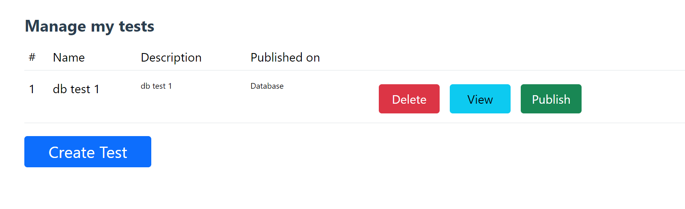
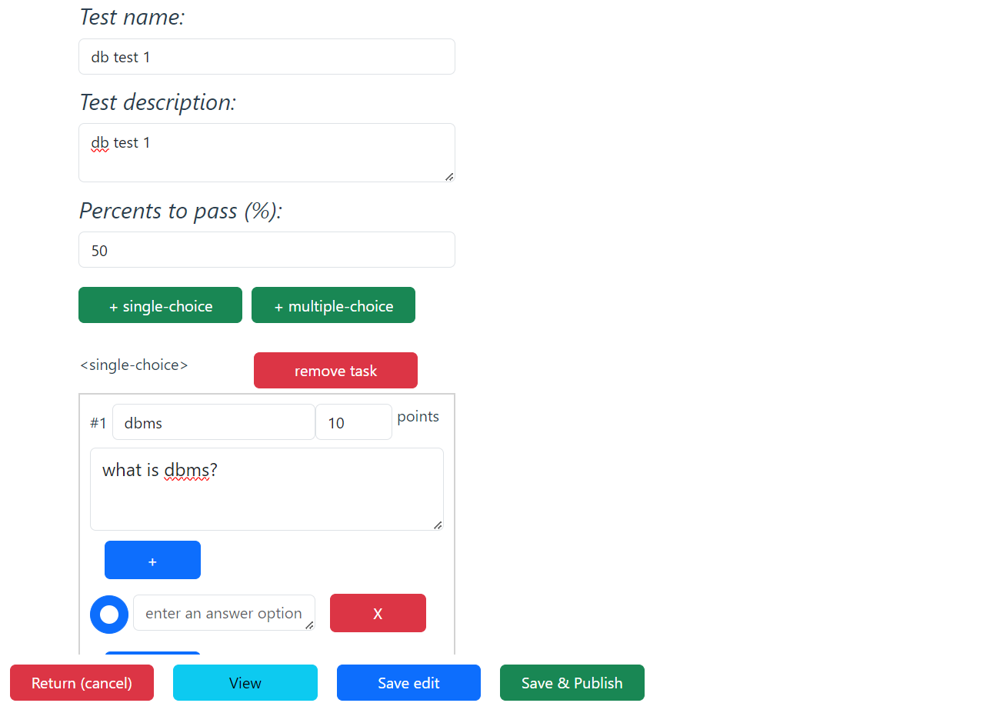

# StudentQuiz

Web Applikation, die mit Microservices aufgebaut ist.
Idee: Eine App ist als ein Testsystem für die Studierenden und für die Lehrkräfte gedacht. Das Programm soll das Testen von Studierenden erleichtern.

**Applikation Deployment auf VM**

Um die App zum Laufen zu kriegen, muss man einige Punkte beachten. (Hier werden allgemeine Punkte beschrieben, wie die Programm sich für jedes Betriebssystem installieren lässt): 
1. Docker muss vorinstalliert werden, weil alle Services sind als Images dargestellt. (https://docs.docker.com/engine/install/)
2. Wenn nicht vorhanden ist, dann muss Docker-Compose auch zusätzlich installiert werden.  (https://docs.docker.com/compose/install/)
3. Clone Repository mit <code>git clone </code>Befehl (https://gitlab.hrz.tu-chemnitz.de/praktikum-scc/ws23-gruppe7/studentquiz.git)
4. <code>cd studentquiz</code> 
5. <code>docker compose up --build</code>
6. https://185.128.119.222:5000 und https://185.128.119.222:5151 abrufen um Bedienungen für Zertifikate zu akzeptieren
7. Applikation auf https://185.128.119.222:5151 nutzen

**Wichtig!**: *Die App soll via Links (https://185.128.119.222:5151) zugänglich sein. Sonst bei der lokalen Ausführung (https://127.0.0.1:5151). **Zurzeit sind die Hosts und Ports für VM konfiguriert.** Allerdings kann man Ports und Hosts von den jeweiligen Services in den entsprechenden .env-Dateien konfigurieren.*
Https version verlangt eine Risikobestätigung, da selbst erstellte Zertifikate für HTTPS benutzt werden. Um das zu lösen, muss man (https://185.128.119.222:5000) abrufen und Risiko für das Zertifikat annehmen. Danach kann man (https://185.128.119.222:5151) öffnen, wieder das Zertifikat akzeptieren.

Um runterzubringen: <code>docker compose down</code> (von studentquiz Ordner)

Für das Testen stehen folgende Nutzerkonten mit verschiedenen Rollen zur Verfügung:
- Admin:
   - username: `admin`
   - password: `qwerty123`
- Teacher:
   - username: `mmm`
   - password: `boss`
- Teacher:
   - username: `musterfrau`
   - password: `qwe`
- Student:
   - username: `alice`
   - pasword: `123`
- Kurszuganscodes:
   - Math (Group 1):
      - teacher: `teacher1`
      - student: `3001`
   - Math (Group 2):
      - teacher: `teacher2`
      - student: `tuesday`

*Beispielszenario für den kurzen Test:* als `mmm`-Teacher einloggen und den Test für gewählten Kurs publizieren. In einem anderen Tab als Student einloggen und sich für einen Kurs einschreiben. Test ablegen und den Fortschritt auf der Lehrerseite kontrollieren.

**Team:**
+ Volodymyr Drobitko - Bachelor Inf. 7. Semester
+ Oleksandr Nazymko - Bachelor Inf. 5. Semester
+ Anastasiia Zimnenko - Master Inf. 3. Semester

**Haupt-Features für Lehrer**
+ Kursen erstellen / bearbeiten
+ Tests erstellen / bearbeiten
+ Ergebnisse in Echtzeit anschauen

**Haupt-Features für Studierenden**
+ sich für die Kursen einschreiben
+ Tests ablegen
+ Ergebnisse abrufen

**Vorgehensweise:**
* Top-Down Approach übergehend zu Down-Top
* Konzepierung der SOA-Architektur mit GatewayAPI and Reverseproxy mit einer Sicherheitsschicht
* Die Microservices sind voneinander unabhängig und können verteilt deployed werden
* Entwurf der Entitäten, die Microservices verarbeiten und austauschen
* Entwicklung der GatewayAPI mit Authentifizierung
* UserService (Minimalfunktionalität)
* TestService zur Erzeugung der Tests
* SubjectService für Kursverwaltung
* Frontend wurde parallel für jeweilige Services entwickelt. Mit der Entwicklung von UserInterface entstanden neue Herausforderungen für Backend.

**Verwendete Platform / SW:**
+ Visual Studio Code: IDE (https://code.visualstudio.com/download).
+ WSL/Ubuntu, VM/Debian: Betriebsystem von der virtuellen Maschine.  
+ Python/Flask: Framework für Python (https://flask.palletsprojects.com/en/3.0.x/installation/).
+ Vue Typescript: Framework für Front-End (https://vuejs.org/guide/quick-start).
+ NodeJS: für Front-End hosting (https://nodejs.org/en/download).
+ Docker/Docker-compose: Deployment

**Microservices**

+ FrontendQuiz
+ GatewayAPI
+ UserService
+ TestService
+ SubjectService

**Datentypbeschreibung:** 

UserService Typen:
+ Credentials: enthält den Nutzernamen und das Passwort von dem User.
+ Role (enum): definiert die Rolle von dem User: Admin, Lehrer oder Student.
+ UserInfo: enthält sämtliche Daten von dem User, wie den Namen, Username, die Rolle und Token.
+ User: enthält UserInfo und Credentials.

TestService Typen:
+ TaskType(enum): definiert den Typ von der Aufgabe: SingleChoiceTask oder MultipleChoiceTask.
+ Task: enthält gesamte Informationen zu den Aufgaben, wie Frage, Tag(Thema von der Frage), Liste von den Optionen, Typ der Aufgabe, die richtige Antwort und die Anzahl von Punkten.
+ SingleChoiceTask: Aufgabe mit einer richtigen Antwort. Für die richtige Antwort bekommt man volle Punktzahl. Da sind die Optionen und die richtige Antwort als Variablen dabei.
+ MultipleChoiceTask: Aufgabe mit mehrerer richtigen Antworten. Jede richtig angekreuzte Option liefert Teilpunkte. Da sind die Optionen und die Liste von den richtigen Antworten als Variablen dabei.
+ TestInfo: enthält ID des Tests, Name von dem Test und die Beschreibung.
+ Test: enthält TestInfo, die Liste von Aufgaben und die angeforderte Anzahl von Prozenten, um den Test zu bestehen.
+ TestSolutionAttempt: modelliert die ausgewählten Anworten von dem Student auf jede Testaufgabe. Enthält eine Liste mit Antworten, die Abgabezeit und die Information von wem diese Antworten stammen.
+ CheckedAttempt: wird benutzt, um den geprüften Test zu speichern. Enthält Informationen von dem TestSolutionAttempt, eine Liste von Punkten für die jeweiligen Aufgaben, die gesamte Zahl der Testpunkte, die erzielten Punkte, die Bewertung in Prozent und boolische Variable, ob der Test bestanden wurde oder nicht.
+ TestInstance: eine Publikation eines Tests in einem Kurs. Enthält Test, eine Remarke zu dem Test, Datum und Zeit der Publikation des Tests, die Information wer den Test gepostet hat und die Liste der Lösungsversuche.     

SubjectService Typen:
+ SubjectInfo: enthält die ID von dem Kurs(Subject), den Namen, die Beschreibung, den Besitzer und eine Liste von den Lehrer, die den Zugriff zu den Subject haben.
+ Subject: enthält SubjectInfo, den Zugangscode für die Studierenden, den Zugangscode für die Lehrkräfte, eine Liste mit den Studierenden, die dem Kurs folgen und eine Liste von den Testinstanzen, die zu diesem Kurs hinzugefügt wurden.

**Schnittstellenbeschreibung des Web Services:**

Gateway API:
Alle Services kommunizieren über Gateway API Service. Das ist eine Art von Microservice, das sowohl alle Anfragen zwischen Frontend und Backend, als auch die zwischen Services von Backend steuert. Alle möglichen Schnittstellen sind da registriert worden und werden nach Bedarf angefragt. In GatewayAPI werden Authentifizierung und Authorisierung(Kontrolle der Zugriffsrechte) durchgeführt.

Anmerkung: *In jedem Service existiert die <code>_register_routes(self)</code> Methode, die für die Registrierung von allen Endpoints des Services entwickelt wurde. Die Anfragen auf /frontend_api sind für Frontend Service, die Anfragen auf /service_api sind für Backend Services.*

UserService Methoden:
+ <code>'/frontend_api/get_token'</code> : generiert einen Token für den Nutzer.
+ <code>'/frontend_api/refresh_token'</code>: der Token wird geupdatet.
+ <code>'/frontend_api/register_user'</code>: den neuen User hinzufügen.
+ <code>'/frontend_api/get_user_info/<username></code>': die Informationen von dem User bekommen.
+ <code>'/service_api/get_user_info/<username>'</code>: ein Service-Endpoint, um die Information des Users zu bekommen. 
+ <code>'/frontend_api/get_all_users_info'</code>: liefert Informationen von allen Users zurück.
+ <code>'/frontend_api/delete_user/<username>'</code>: den User löschen.

TestService Methoden:
+ <code>'/frontend_api/get_my_tests_info'</code>: liefert alle Tests von dem Lehrer.
+ <code>'/frontend_api/get_test_info/<test_id>'</code>: liefert eine Instanz von dem Typ TestInfo.
+ <code>'/frontend_api/get_test'</code>: erzeugt einen leeren Test.
+ <code>'/frontend_api/save_test/<test_id></code>': speichert den Test nach der Editierung. 
+ <code>'/frontend_api/get_all_tests_info'</code>: gibt die Informationen von allen Tests zurück. 
+ <code>'/service_api/get_test/<test_id>'</code>: ein Service-Endpoint, um die Daten von einem Test zu bekommen. 
+ <code>'/frontend_api/get_test/<test_id>'</code>: liefert einen Test.
+ <code>'/frontend_api/delete_test/<test_id>'</code>: der Test wird gelöscht.

SubjectService Methoden:
+ <code>'/frontend_api/get_my_subjects_info'</code>: liefert die Informationen über die Kurse von einem Lehrer. 
+ <code>'/frontend_api/get_all_subjects_info'</code>: liefert die Informationen über alle Kurse.
+ <code>'/frontend_api/get_subject_info/<subject_id>'</code>: liefert die Information über einen konkreten Kurs.
+ <code>'/frontend_api/publish_test/<subject_id>/<test_id>'</code>: der Test wird in einem Kurs veröffentlicht.
+ <code>'/frontend_api/save_subject/<subject_id>'</code>: der Kurs wird nach der Editierung gespeichert.
+ <code>'/frontend_api/delete_subject/<subject_id>'</code>: der Kurs wird gelöscht.
+ <code>'/frontend_api/get_subject/<subject_id>'</code>: liefert einen Kurs(nur der Lehrer bekommt die volle Kursversion).
+ <code>'/frontend_api/get_subject'</code>: einen leeren Kurs erzeugen.
+ <code>'/frontend_api/subject_subscribe_teacher/<subject_id>'</code>: der Lehrer schreibt sich für einen Kurs ein.
+ <code>'/frontend_api/subject_subscribe_student/<subject_id>'</code>: der Student schreibt sich für einen Kurs ein. 
+ <code>'/frontend_api/remove_teacher_from_subject/<subject_id>/<username>'</code>: die Zugriffsrechte für einen Lehrer wird weggenommen.
+ <code>'/frontend_api/remove_student_from_subject/<subject_id>/<username>'</code>: die Zugriffsrechte für einen Studenten wird weggenommen.
+ <code>'/frontend_api/save_test_attempt/<subject_id>'</code>: ein Lösungsversuch wird gespeichert.
+ <code>'/frontend_api/get_task_results/<subject_id>'</code>: gibt die Ergebnisse der Aufgaben zurück. 
+ <code>'/frontend_api/get_test_summary/<subject_id>'</code>: berechnet die Zusammenfassung aller Lösungsversuche.
+ <code>'/frontend_api/get_student_results/<subject_id>'</code>:der Student kann eigene Ergebnisse für einen Kurs ansehen.
+ <code>'/frontend_api/get_subjects_info_published/<test_id>'</code>: prüft, in welchen Kursen der Test veröffentlicht wurde.

**Bedienungsanleitung für Clients**
Anmeldung/ Registrierung ( als Student oder als Prüfer )
Design ist für die Nutzung auf Handys besonders gut geeignet. Das UserInterface wurde intuitiv und nutzerfreundlich entworfen.
 1. Student: als Studierende kann man sich einloggen, registrieren und mit Tests von verschiedenen Kursen arbeiten.
    + Login: dafür muss man die Login im Menü auswählen, dann wird man zu einer Anmeldungsseite weitergeleitet. Da soll man die Anmeldedaten (username und Passwort) eingeben. Nach dem Tastedruck auf die Login Button wird man angemeldet. Falls die Daten falsch sind, bekommt man eine Fehlermeldung. 
    
    + Registrierung: dafür muss man wieder Login im Menu auswählen, dann auf Button Register drücken, um die Form für die Registrierung zu sehen. Da gibt man den Namen, Status, Username und Passwort ein, um sich zu registrieren. 
    
    + Anmeldung für ein Subject: wenn man eingeloggt ist, kann man sich für verschiedene Kursen anmelden. Dafür drückt man auf Quiz-Button in der Menu. Da wählt man das Subject aus, was man braucht, gibt den Zugriff-Code ein und drückt auf Subscribe. Damit bekommt man den Zugriff zu dem Kurs und zu allen freigeschalteten Tests des Kurses. Unten auf der selben Seite sieht man alle Kursen, die man folgt.   
    
    + Test bestehen: wenn man sich für einen Kurs eingeschrieben hat, kann man auch Tests beshtehen. Dafür klikt man auf Quiz in Menu, dann wählt man unten ein Subject aus. In diesem Subject sieht man alle Tests, die mit diesem Kurs verknüpft sind. 
    
    Man soll auf den belibigen Test kliken, um die Informationen dazu zu sehen. 
     
    Nachdem man auf Start test Button drückt, hat man die Möglichkeit die Fragen zu beantworten und den Test anzugeben. Dafür bitte auf die Submit test-Taste kliken.  
    
    Das erlaubt die Ergebnisse sofort zu sehen. 
    

 2. Teacher: kann sich einloggen, registrieren lassen, Tests erstellen, diese zu einem Subject hinzufügen, Ergebnisse von den Studenten anschauen. 
    + <i>Login</i>:  dafür muss man die Log in Taste in der Menu drücken, dann wird man zu einer Anmeldungsseite weitergeleitet. Da soll man die Anmeldedaten (username und Passwort) eingeben. Nach dem Druck auf die log-in Taste wird man angemeldet. Falls die Daten falsch sind, bekommt man eine Fehlermeldung.
    + Registrierung: dafür muss man wieder die Log in Taste in der Menu auswählen, dann auf Button Register drücken, um die Form für die Registrierung zu sehen. Da gibt man den Namen, Status, username und Passwort ein, um sich registrieren zu lassen. 
    + Subject erstellen: in der Menu wählt man den Punkt Subject aus, auf der Seite unten finden man Button Create Subject.
    
    Wenn man da drauf clickt, kann man den neuen Kurs erstellen. Dafür gibt man den Namen, die Beschreibung und die Codes für die anderen Lehrer und für die Studierenden ein.  
    
    Mit dem Click auf Save&Publish Button wird der Kurs gespeichert und für alle zugänglich gemacht. Dafür muss man auf der nächsten Seite die Tests für den Subject auswählen und auf Publih Button clicken. 
    
    + Test erstellen: in der Menu auf Test drücken, da kann man  Create Test Button finden. 
    
    Somit man darauf geclickt hat, sieht man einen Konstruktor, um Tests zu erstellen. Zurzeit gibt es nur Zeit verschiedene Optionen für Fragen (Single choise und multiple choise). 
    
    Um den Test zu speichern und mit einem Subject zu verknüpfen, clickt man auf Save&Publish. Da gibt es direkt eine Möglichkeit den Test zu einem Subejct hinzuzufügen.  

 3. Admin: den gesamten Verlauf von allen User sehen, diese auch steuern (löschen). Kursen bearbeiten und löschen, Test bearbeiten und löschen. Kann alles sehen und löschen(Außer Testantworten und Ergebnisse).

Anmerkung: *Alle möglichen Features des Frontends sollen funktionsfähig sein auch wenn sie nicht in der Doku beschrieben wurden.*

**Ideen für die Erweiterungen der App**
+ Datenbank hinzufügen
+ weitere Services hinzufügen (wie z.B. BewertungService...)
+ Design verbessern
+ Passwort-Qualität prüfen
+ Registation verbessern (z.B. )
+ weitere Test-Arten hinzufügen 
+ Funktionen für Importieren und Exportieren von Testsvorlagen

**Feedback + Kritik an Praktikum**

Es wäre schöner, wenn Tutorials tiefer sein würden und früher gezeigt wurden. Es gab schwierigkeiten mit mit folgenen Themen: HTTPS, DomainNamen Registrierung, DNS.
